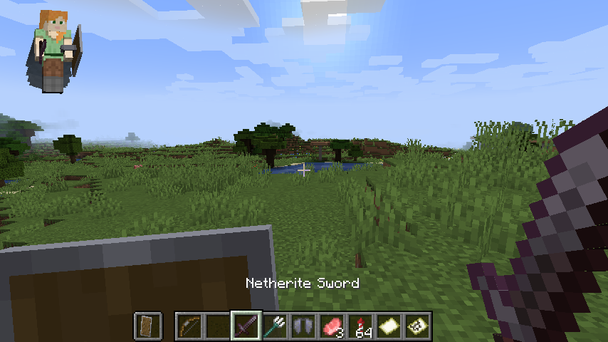
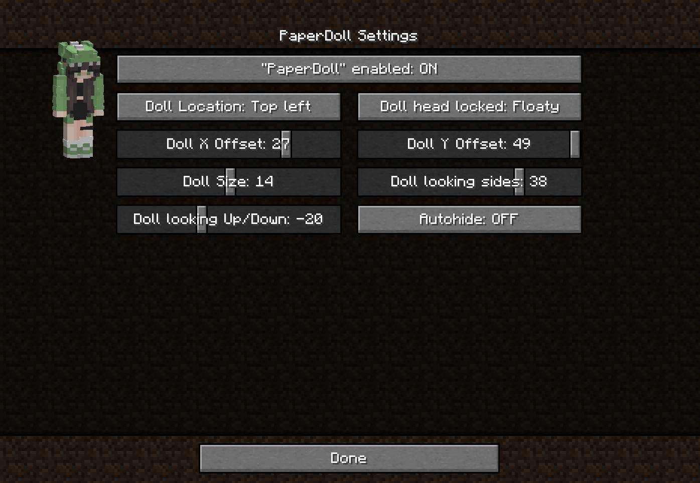

# PaperDoll

Shows a Bedrock/PocketEdition like highly configurable PaperDoll.

## Configuration

You can access the config screen in the Modlist (Fabric requires [ModMenu](https://www.curseforge.com/minecraft/mc-mods/modmenu), for Forge you should use [Game Menu Mod Option](https://www.curseforge.com/minecraft/mc-mods/gamemenumodoption)). While ingame, you will also get a live preview of the applied changes.

## License

This project is licensed under [``tr7zw Protective License``](LICENSE).
This license does not allow others to distribute the software/derivative works(in source or binary form).
You have to contact the author to get permission for redistribution. (For example: Modpacks(that are not hosted on CurseForge), "Clients", mod hosting sites).
Keep in mind that [Githubs TOS](https://docs.github.com/en/github/site-policy/github-terms-of-service#d-user-generated-content) and [Overwolfs TOS](https://www.overwolf.com/legal/terms/) apply at their respective places. This (among other things) means you don't need to ask to include the mod in a CurseForge Modpack and that by contributing code it explicitly gets the same license as the repository.
